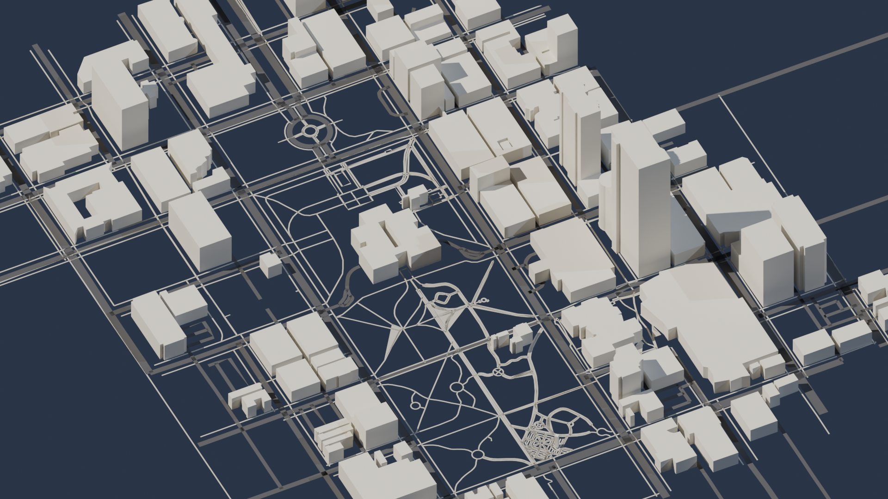

# Mapforge

Generate real-world 3D city assets from any location on Earth. Type a city name, select an area, and export a game-ready GLB file in seconds — powered by OpenStreetMap data and React Three Fiber.

Built for game developers, architects, urban planners, and anyone who needs real-world geometry without the manual modeling work.



---

## What It Does

Mapforge turns real geographic data into production-ready 3D assets:

- **Search any city** by name — no coordinates required
- **Select your area** using a resizable, draggable bounding box
- **Rotate the map** to align your selection with any building orientation
- **Generate a 3D scene** with buildings, roads, and pedestrian paths from live OSM data
- **Export as GLB** — ready to open in Blender, Unity, Unreal Engine, or Godot

---

## Features

### Map Selection
- **City name search** — geocoded via Nominatim, auto-centers and draws selection box on result
- **Size presets** — Small (~¼ mi), Medium (~1 mi), Large (~4 mi) bounding box quick-set buttons
- **Free drag** — click and drag the selection box to reposition without redrawing
- **Map rotation** — align the underlying map to any bearing using Shift+scroll or the compass drag handle, leaving the selection box fixed on screen
- **Tile buffering** — extended tile preload prevents grey areas when rotating

### 3D Generation
- **Buildings** — extruded from OSM footprints with real height data where available
- **Roads** — rendered as width-accurate ribbon meshes by highway type (motorway, residential, footway, etc.)
- **Pedestrian paths** — distinct material tier, thinner geometry, visually separate from vehicle roads
- **Shared materials** — buildings, roads, and paths each use a single shared material instance (not one per mesh), keeping file sizes small and draw calls efficient

### GLB Export
- **Clean export pipeline** — all geometry confirmed exportable via `userData.exportToGLB`
- **Road export fix** — `useEffect` pattern writes directly to Three.js mesh userData, bypassing R3F reconciler deferral that previously caused road meshes to be omitted
- **Road clipping** — meshes whose center point falls outside the bounding box are excluded, preventing stray geometry in tight selections
- **3 material slots** — buildings (warm stone), roads (dark asphalt), paths (tan) — consolidates cleanly in any 3D application

---

## Improvements Over Original (cartesiancs/map3d)

This fork extends the original map3d with the following additions:

| Feature | Original | Mapforge |
|---|---|---|
| Location input | Coordinates only | City name search |
| Bounding box | Fixed | S/M/L presets + draggable |
| Map rotation | None | Shift+scroll + compass drag |
| Road rendering | Basic line primitives | Width-accurate ribbon meshes |
| Pedestrian paths | Not rendered | Distinct material + geometry |
| Material count | 1 per mesh | 3 shared instances |
| Road export | Missing (R3F deferral bug) | Fixed via useEffect |
| Road clipping | None | Center-point bbox filter |

---

## Tech Stack

- **React + Vite + TypeScript**
- **React Three Fiber** — 3D scene rendering
- **Three.js** — geometry, materials, GLB export
- **Leaflet + leaflet-rotate** — 2D map selection with bearing control
- **OpenStreetMap / Overpass API** — building and road data
- **Nominatim** — city name geocoding

---

## Getting Started

```bash
git clone https://github.com/stonyp/mapforge
cd mapforge
npm install
npm run dev
```

Open `http://localhost:5173` in your browser.

---

## Usage

1. **Search** — type a city name and press Enter or click Search
2. **Resize** — use S/M/L buttons to set the selection area, or drag the box to reposition
3. **Rotate** — hold Shift and scroll to rotate the map; drag the compass for fine control
4. **Generate** — click Generate to fetch OSM data and build the 3D scene
5. **Export** — click Export GLB to download the scene file

### Importing into Blender
- Use **Blender 4.3 LTS** — the glTF importer in Blender 5.x has a known regression with certain mesh attribute layouts
- File → Import → glTF 2.0 (.glb/.gltf)
- Set Clip End to 100000 in the viewport N panel → View tab if geometry disappears

### Importing into Unity / Unreal / Godot
- GLB imports natively in all three engines
- Coordinate system: Three.js Y-up — Blender converts automatically; Unity and Unreal may require a 90° X rotation on import

---

## Roadmap

- [ ] Free corner resize handles on selection box
- [ ] Terrain / heightmap support
- [ ] Water bodies (rivers, lakes)
- [ ] Procedural textures by building type
- [ ] LOD export variants
- [ ] Auth + saved map library (Supabase)
- [ ] Billing tiers — free watermarked / pro clean export (Stripe)

---

## Credits

- Original project: [cartesiancs/map3d](https://github.com/cartesiancs/map3d)
- Map data: © [OpenStreetMap](https://www.openstreetmap.org/) contributors
- Built by [stonyp](https://github.com/stonyp)

---

## License

MIT
